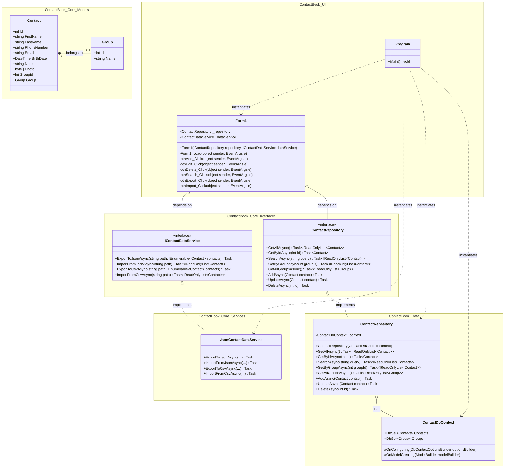

# Диаграмма классов решения (Class Diagram)

```mermaid
classDiagram
    namespace ContactBook_Core_Models {
        class Contact {
            +int Id
            +string FirstName
            +string LastName
            +string PhoneNumber
            +string Email
            +DateTime BirthDate
            +string Notes
            +byte[] Photo
            +int GroupId
            +Group Group
        }
        class Group {
            +int Id
            +string Name
        }
    }

    namespace ContactBook_Core_Interfaces {
        class IContactRepository {
            <<interface>>
            +GetAllAsync() Task~IReadOnlyList~Contact~~
            +GetByIdAsync(int id) Task~Contact~
            +SearchAsync(string query) Task~IReadOnlyList~Contact~~
            +GetByGroupAsync(int groupId) Task~IReadOnlyList~Contact~~
            +GetAllGroupsAsync() Task~IReadOnlyList~Group~~
            +AddAsync(Contact contact) Task
            +UpdateAsync(Contact contact) Task
            +DeleteAsync(int id) Task
        }
        class IContactDataService {
            <<interface>>
            +ExportToJsonAsync(string path, IEnumerable~Contact~ contacts) Task
            +ImportFromJsonAsync(string path) Task~IReadOnlyList~Contact~~
            +ExportToCsvAsync(string path, IEnumerable~Contact~ contacts) Task
            +ImportFromCsvAsync(string path) Task~IReadOnlyList~Contact~~
        }
    }

    namespace ContactBook_Core_Services {
        class JsonContactDataService {
            +ExportToJsonAsync(...) Task
            +ImportFromJsonAsync(...) Task
            +ExportToCsvAsync(...) Task
            +ImportFromCsvAsync(...) Task
        }
    }

    namespace ContactBook_Data {
        class ContactDbContext {
            +DbSet~Contact~ Contacts
            +DbSet~Group~ Groups
            #OnConfiguring(DbContextOptionsBuilder optionsBuilder)
            #OnModelCreating(ModelBuilder modelBuilder)
        }
        class ContactRepository {
            -ContactDbContext _context
            +ContactRepository(ContactDbContext context)
            +GetAllAsync() Task~IReadOnlyList~Contact~~
            +GetByIdAsync(int id) Task~Contact~
            +SearchAsync(string query) Task~IReadOnlyList~Contact~~
            +GetByGroupAsync(int groupId) Task~IReadOnlyList~Contact~~
            +GetAllGroupsAsync() Task~IReadOnlyList~Group~~
            +AddAsync(Contact contact) Task
            +UpdateAsync(Contact contact) Task
            +DeleteAsync(int id) Task
        }
    }

    namespace ContactBook_UI {
        class Form1 {
            -IContactRepository _repository
            -IContactDataService _dataService
            +Form1(IContactRepository repository, IContactDataService dataService)
            -Form1_Load(object sender, EventArgs e)
            -btnAdd_Click(object sender, EventArgs e)
            -btnEdit_Click(object sender, EventArgs e)
            -btnDelete_Click(object sender, EventArgs e)
            -btnSearch_Click(object sender, EventArgs e)
            -btnExport_Click(object sender, EventArgs e)
            -btnImport_Click(object sender, EventArgs e)
        }
        class Program {
            +Main() void
        }
    }

    Contact "1" *-- "0..1" Group : belongs to
    IContactRepository <|.. ContactRepository : implements
    IContactDataService <|.. JsonContactDataService : implements
    ContactRepository o-- ContactDbContext : uses
    Form1 o-- IContactRepository : depends on
    Form1 o-- IContactDataService : depends on
    Program ..> Form1 : instantiates
    Program ..> ContactDbContext : instantiates
    Program ..> ContactRepository : instantiates
    Program ..> JsonContactDataService : instantiates
```
