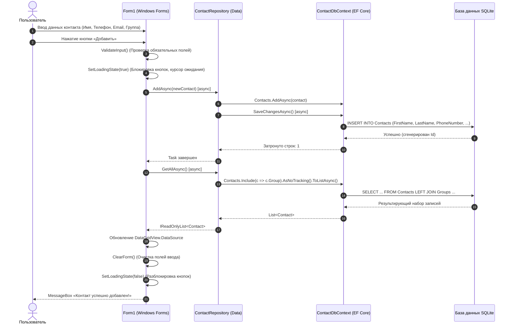

# Диаграмма последовательности (Sequence Diagram)
**Сценарий:** Добавление нового контакта в ContactBook

```mermaid
sequenceDiagram
    autonumber
    actor User as Пользователь
    participant UI as Form1 (Windows Forms)
    participant Repo as ContactRepository (Data)
    participant DB as ContactDbContext (EF Core)
    participant SQLite as База данных SQLite

    User->>UI: Ввод данных контакта (Имя, Телефон, Email, Группа)
    User->>UI: Нажатие кнопки «Добавить»
    UI->>UI: ValidateInput() (Проверка обязательных полей)
    UI->>UI: SetLoadingState(true) (Блокировка кнопок, курсор ожидания)
    UI->>Repo: AddAsync(newContact) [async]
    Repo->>DB: Contacts.AddAsync(contact)
    Repo->>DB: SaveChangesAsync() [async]
    DB->>SQLite: INSERT INTO Contacts (FirstName, LastName, PhoneNumber, ...)
    SQLite-->>DB: Успешно (сгенерирован Id)
    DB-->>Repo: Затронуто строк: 1
    Repo-->>UI: Task завершен
    UI->>Repo: GetAllAsync() [async]
    Repo->>DB: Contacts.Include(c => c.Group).AsNoTracking().ToListAsync()
    DB->>SQLite: SELECT ... FROM Contacts LEFT JOIN Groups ...
    SQLite-->>DB: Результирующий набор записей
    DB-->>Repo: List<Contact>
    Repo-->>UI: IReadOnlyList<Contact>
    UI->>UI: Обновление DataGridView.DataSource
    UI->>UI: ClearForm() (Очистка полей ввода)
    UI->>UI: SetLoadingState(false) (Разблокировка кнопок)
    UI-->>User: MessageBox «Контакт успешно добавлен!»
```
